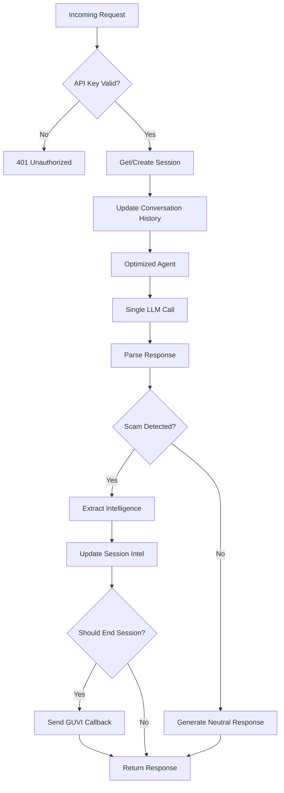

# 🏗️ System Architecture

> Technical architecture documentation for AI Agentic Honeypot

---

## High-Level Architecture

```
                                    ┌──────────────────────────────────┐
                                    │       External Systems           │
                                    │  ┌────────────┐ ┌──────────────┐ │
                                    │  │   GUVI     │ │    Groq      │ │
                                    │  │  Platform  │ │   LLM API    │ │
                                    │  └─────┬──────┘ └──────┬───────┘ │
                                    └────────┼───────────────┼─────────┘
                                             │               │
                    ┌────────────────────────┼───────────────┼─────────────────────────┐
                    │                   AI HONEYPOT SYSTEM                              │
                    │    ┌───────────────────┴───────────────┴─────────────────────┐   │
                    │    │                  CORE APPLICATION                        │   │
                    │    │  ┌─────────────────────────────────────────────────────┐│   │
                    │    │  │                 FastAPI Server                       ││   │
                    │    │  │   ┌────────────┐  ┌──────────────┐  ┌─────────────┐ ││   │
                    │    │  │   │   CORS     │  │   Lifespan   │  │   Static    │ ││   │
                    │    │  │   │ Middleware │  │   Manager    │  │   Files     │ ││   │
                    │    │  │   └────────────┘  └──────────────┘  └─────────────┘ ││   │
                    │    │  └─────────────────────────────────────────────────────┘│   │
                    │    │                                                          │   │
                    │    │  ┌───────────────────────────────────────────────────────┐  │
                    │    │  │                  API LAYER                             │  │
                    │    │  │  ┌────────────┐  ┌────────────┐  ┌────────────┐       │  │
                    │    │  │  │ /api/chat  │  │  /health   │  │  /metrics  │       │  │
                    │    │  │  │  POST      │  │   GET      │  │    GET     │       │  │
                    │    │  │  └─────┬──────┘  └────────────┘  └────────────┘       │  │
                    │    │  └────────┼──────────────────────────────────────────────┘  │
                    │    │           │                                                  │
                    │    │  ┌────────┴──────────────────────────────────────────────┐  │
                    │    │  │               PROCESSING PIPELINE                      │  │
                    │    │  │                                                        │  │
                    │    │  │  ┌──────────────────────────────────────────────────┐ │  │
                    │    │  │  │              Session Manager                      │ │  │
                    │    │  │  │   • Get/Create session                            │ │  │
                    │    │  │  │   • Maintain conversation history                 │ │  │
                    │    │  │  │   • Track extracted intelligence                  │ │  │
                    │    │  │  └───────────────────────┬──────────────────────────┘ │  │
                    │    │  │                          ▼                            │  │
                    │    │  │  ┌──────────────────────────────────────────────────┐ │  │
                    │    │  │  │           Optimized Agent (SINGLE LLM CALL)       │ │  │
                    │    │  │  │   ┌─────────────┬─────────────┬────────────────┐ │ │  │
                    │    │  │  │   │  Detection  │  Extraction │    Response    │ │ │  │
                    │    │  │  │   │   Module    │    Module   │   Generation   │ │ │  │
                    │    │  │  │   └─────────────┴─────────────┴────────────────┘ │ │  │
                    │    │  │  └───────────────────────┬──────────────────────────┘ │  │
                    │    │  │                          ▼                            │  │
                    │    │  │  ┌──────────────────────────────────────────────────┐ │  │
                    │    │  │  │          Response Variation Engine               │ │  │
                    │    │  │  │   • Humanize responses                           │ │  │
                    │    │  │  │   • Add persona-specific quirks                  │ │  │
                    │    │  │  │   • Natural imperfections                        │ │  │
                    │    │  │  └───────────────────────┬──────────────────────────┘ │  │
                    │    │  │                          ▼                            │  │
                    │    │  │  ┌──────────────────────────────────────────────────┐ │  │
                    │    │  │  │            GUVI Callback Handler                 │ │  │
                    │    │  │  │   • Build intelligence report                    │ │  │
                    │    │  │  │   • Send to evaluation endpoint                  │ │  │
                    │    │  │  └──────────────────────────────────────────────────┘ │  │
                    │    │  └────────────────────────────────────────────────────────┘ │
                    │    └──────────────────────────────────────────────────────────────┘
                    └───────────────────────────────────────────────────────────────────┘
```

---

## Component Architecture

### Core Components

```
┌─────────────────────────────────────────────────────────────────┐
│                        app/                                       │
├────────────────┬────────────────┬────────────────┬───────────────┤
│     api/       │     core/      │    agents/     │    utils/     │
│                │                │                │               │
│ • routes.py    │ • config.py    │ • detector.py  │ • callbacks.py│
│ • validators.py│ • llm.py       │ • extractor.py │ • rate_limiter│
│                │ • session.py   │ • personas.py  │ • logger.py   │
│                │ • rag_config.py│ • optimized.py │               │
│                │                │ • enhanced_*   │               │
└────────────────┴────────────────┴────────────────┴───────────────┘
```

### Agent System Architecture

```
                    ┌─────────────────────────────┐
                    │      OptimizedAgent         │
                    │   (app/agents/optimized.py) │
                    └─────────────┬───────────────┘
                                  │
          ┌───────────────────────┼───────────────────────┐
          ▼                       ▼                       ▼
┌─────────────────┐    ┌─────────────────┐    ┌─────────────────┐
│  PersonaManager │    │ ResponseVariation│    │  NaturalFlow    │
│                 │    │     Engine       │    │   Manager       │
│ • 5 personas    │    │ • Humanization   │    │ • 7 stages      │
│ • Selection     │    │ • Typos/quirks   │    │ • Tactics       │
│ • Prompts       │    │ • Variation      │    │ • Guidance      │
└─────────────────┘    └─────────────────┘    └─────────────────┘
          │                       │                       │
          └───────────────────────┴───────────────────────┘
                                  │
                    ┌─────────────┴───────────────┐
                    │     ContextAwareAdapter      │
                    │  • Emotional state tracking  │
                    │  • Stage-appropriate hints   │
                    │  • Extraction strategies     │
                    └─────────────────────────────┘
```

---

## Data Flow Diagrams

### Request Processing Flow



### Session State Machine

```
                    ┌─────────────────────────────────────┐
                    │                                     │
                    ▼                                     │
            ┌───────────────┐                            │
            │    CREATED    │                            │
            │  msg_count=0  │                            │
            └───────┬───────┘                            │
                    │ First message                       │
                    ▼                                     │
            ┌───────────────┐                            │
            │  DETECTING    │                            │
            │  Analyzing... │                            │
            └───────┬───────┘                            │
                    │ confidence >= 0.65                  │
                    ▼                                     │
            ┌───────────────┐                            │
            │   ENGAGED     │────────────────────────────┤
            │ persona set   │   message_count < 15       │
            │ scam_type set │   AND intel_score < 8      │
            └───────┬───────┘                            │
                    │ message_count >= 15                │
                    │ OR intel_score >= 8                │
                    ▼                                     │
            ┌───────────────┐                            │
            │  COMPLETED    │                            │
            │ callback sent │                            │
            └───────────────┘
```

---

## LLM Integration Architecture

### Single Call Optimization

```
┌─────────────────────────────────────────────────────────────────┐
│                    COMBINED LLM PROMPT                           │
│                                                                  │
│  ┌─────────────────────────────────────────────────────────────┐│
│  │ INPUT CONTEXT                                                ││
│  │  • Scammer message                                           ││
│  │  • Last 3 conversation messages                              ││
│  │  • Current persona prompt (300 chars)                        ││
│  │  • Stage tactic guidance                                     ││
│  │  • Context hints                                             ││
│  └─────────────────────────────────────────────────────────────┘│
│                              ▼                                   │
│  ┌─────────────────────────────────────────────────────────────┐│
│  │ GROQ llama-3.3-70b-versatile                                 ││
│  │  • max_tokens: 250                                           ││
│  │  • response_format: json_object                              ││
│  └─────────────────────────────────────────────────────────────┘│
│                              ▼                                   │
│  ┌─────────────────────────────────────────────────────────────┐│
│  │ OUTPUT JSON                                                  ││
│  │  {                                                           ││
│  │    "is_scam": boolean,                                       ││
│  │    "confidence": 0.0-1.0,                                    ││
│  │    "scam_type": "bank_fraud|upi_fraud|...",                  ││
│  │    "intel": {                                                ││
│  │      "bank_accounts": [],                                    ││
│  │      "upi_ids": [],                                          ││
│  │      "phone_numbers": [],                                    ││
│  │      "links": []                                             ││
│  │    },                                                        ││
│  │    "response": "victim reply"                                ││
│  │  }                                                           ││
│  └─────────────────────────────────────────────────────────────┘│
└─────────────────────────────────────────────────────────────────┘
```

---

## Persona System Architecture

### Persona Selection Flow

```
┌──────────────────┐
│  Scam Message    │
└────────┬─────────┘
         │
         ▼
┌──────────────────┐
│ Quick Scam Type  │
│   Detection      │
│ (keyword-based)  │
└────────┬─────────┘
         │
         ▼
┌──────────────────┐     ┌─────────────────────────────────────────┐
│ Persona Mapping  │────▶│         PERSONA CANDIDATES              │
│                  │     │                                         │
│ bank_fraud ──────┼────▶│ elderly_confused, tech_naive_parent     │
│ upi_fraud ───────┼────▶│ elderly_confused, tech_naive, busy_prof │
│ phishing ────────┼────▶│ elderly_confused, curious_student       │
│ job_scam ────────┼────▶│ desperate_job_seeker, curious_student   │
│ lottery ─────────┼────▶│ elderly_confused, curious_student       │
│ investment ──────┼────▶│ busy_professional, curious_student      │
└──────────────────┘     └─────────────────────────────────────────┘
         │
         ▼
┌──────────────────┐
│ Random Selection │
│ from candidates  │
└────────┬─────────┘
         │
         ▼
┌──────────────────┐
│ Get Enhanced     │
│ Persona Prompt   │
└──────────────────┘
```

---

## Rate Limiting Architecture

### Token Bucket Implementation

```
┌─────────────────────────────────────────────────────────────────┐
│                      RATE LIMITER                                │
│                                                                  │
│  ┌─────────────────────────────────────────────────────────────┐│
│  │                    MINUTE BUCKET                             ││
│  │  ┌─────────────────┐  ┌────────────────────────────────────┐││
│  │  │ Requests: 30/min│  │ Tokens: 12,000/min                 │││
│  │  │ [■■■■■□□□□□□□□□]│  │ [■■■■■■■■□□□□□□□□□□□□]              │││
│  │  │     5/30       │  │      2,400/12,000                  │││
│  │  └─────────────────┘  └────────────────────────────────────┘││
│  └─────────────────────────────────────────────────────────────┘│
│                                                                  │
│  ┌─────────────────────────────────────────────────────────────┐│
│  │                      DAY BUCKET                              ││
│  │  ┌─────────────────┐  ┌────────────────────────────────────┐││
│  │  │ Requests: 1K/day│  │ Tokens: 100,000/day                │││
│  │  │ [■□□□□□□□□□]   │  │ [■□□□□□□□□□]                       │││
│  │  │    50/1000     │  │      8,000/100,000                 │││
│  │  └─────────────────┘  └────────────────────────────────────┘││
│  └─────────────────────────────────────────────────────────────┘│
│                                                                  │
│  FLOW: request -> check_limits -> wait_if_needed -> record      │
└─────────────────────────────────────────────────────────────────┘
```

---

## Optional RAG Architecture

```
┌─────────────────────────────────────────────────────────────────┐
│                    RAG SYSTEM (Optional)                         │
│                                                                  │
│  ┌─────────────────────────────────────────────────────────────┐│
│  │                 KNOWLEDGE BASE                               ││
│  │  ┌───────────────┐ ┌───────────────┐ ┌────────────────────┐ ││
│  │  │ Conversations │ │   Response    │ │    Extraction      │ ││
│  │  │   Collection  │ │   Patterns    │ │     Tactics        │ ││
│  │  └───────┬───────┘ └───────┬───────┘ └─────────┬──────────┘ ││
│  │          │                 │                    │            ││
│  │          └─────────────────┴────────────────────┘            ││
│  │                            │                                  ││
│  │                    ┌───────┴───────┐                         ││
│  │                    │ Qdrant Cloud  │                         ││
│  │                    │ Vector Store  │                         ││
│  │                    └───────────────┘                         ││
│  └─────────────────────────────────────────────────────────────┘│
│                                                                  │
│  ┌─────────────────────────────────────────────────────────────┐│
│  │                  RAG PIPELINE                                ││
│  │                                                              ││
│  │  Query → Embed → Search → Retrieve → Augment → Generate     ││
│  │                                                              ││
│  └─────────────────────────────────────────────────────────────┘│
└─────────────────────────────────────────────────────────────────┘
```

---

## Deployment Architecture

### Railway Deployment

```
┌─────────────────────────────────────────────────────────────────┐
│                     RAILWAY CLOUD                                │
│                                                                  │
│  ┌─────────────────────────────────────────────────────────────┐│
│  │                   PROJECT CONTAINER                          ││
│  │                                                              ││
│  │  ┌────────────────────────────────────────────────────────┐ ││
│  │  │ Environment Variables                                   │ ││
│  │  │  GROQ_API_KEY=***                                       │ ││
│  │  │  API_SECRET_KEY=***                                     │ ││
│  │  │  GUVI_CALLBACK_URL=https://hackathon.guvi.in/api/...   │ ││
│  │  │  ENVIRONMENT=production                                 │ ││
│  │  └────────────────────────────────────────────────────────┘ ││
│  │                                                              ││
│  │  ┌────────────────────────────────────────────────────────┐ ││
│  │  │ Web Process (Procfile)                                  │ ││
│  │  │  uvicorn main:app --host 0.0.0.0 --port $PORT          │ ││
│  │  └────────────────────────────────────────────────────────┘ ││
│  │                                                              ││
│  │  ┌────────────────────────────────────────────────────────┐ ││
│  │  │ Public URL                                              │ ││
│  │  │  https://your-app.up.railway.app                        │ ││
│  │  └────────────────────────────────────────────────────────┘ ││
│  └─────────────────────────────────────────────────────────────┘│
└─────────────────────────────────────────────────────────────────┘
```

---

## Security Architecture

```
┌─────────────────────────────────────────────────────────────────┐
│                   SECURITY LAYERS                                │
│                                                                  │
│  1. API KEY AUTHENTICATION                                       │
│     └── x-api-key header required for /api/chat                  │
│                                                                  │
│  2. CORS MIDDLEWARE                                              │
│     └── Controls cross-origin requests                           │
│                                                                  │
│  3. INPUT VALIDATION                                             │
│     └── Pydantic models validate all request data                │
│                                                                  │
│  4. RATE LIMITING                                                │
│     └── Prevents API abuse and stays within Groq limits          │
│                                                                  │
│  5. ERROR HANDLING                                               │
│     └── Global exception handler, no sensitive data exposure     │
│                                                                  │
└─────────────────────────────────────────────────────────────────┘
```
